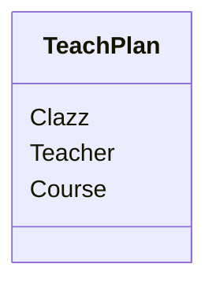
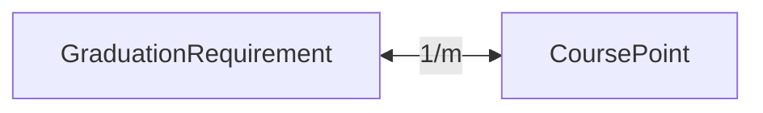
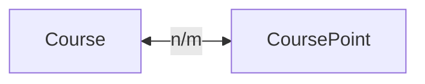
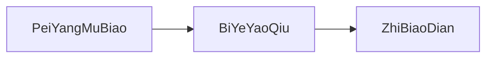
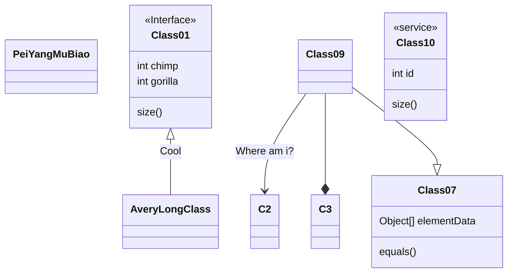

# 功能说明

## 系统管理

- [x] 接口不存在的异常捕获
- [x] 服务发送错误的异常捕获
- [x] 日志可记录到数据库
- [ ] 账号权限控制
- [ ] Redis缓存
- [ ] 获取系统日志
- [ ] 审批待删除数据

### 日志管理

- [x] 日志可记录到数据库
- [x] 分页获取日志API

### 角色管理

- [ ] 添加角色
- [ ] 删除角色
- [ ] 分配角色权限
- [ ] 修改角色名称(角色标识不允许修改)
- [ ] 修改角色描述
- [ ] 获取用户头像

### 用户管理

- [x] 账号登录(获取Token)
- [x] 账号注册(测试使用)
- [ ] 获取个人信息(包含权限信息)
- [ ] 获取账号列表
- [ ] 修改密码
- [ ] 修改姓名(用户名不允许修改)
- [ ] 修改邮箱
- [ ] 修改手机号
- [ ] 修改性别
- [ ] 新增用户
- [ ] 删除用户
- [ ] 启用/禁用用户
- [ ] 导入用户
- [ ] 导出用户
- [ ] 个人数据总览

### 文件管理

- [ ] 获取文件列表
- [ ] 上传文件
- [ ] 下载文件
- [ ] 获取(生成)下载链接
- [ ] 删除文件
- [ ] 文件重命名
- [ ] 启用/禁用文件

## 学校信息管理

### 学院管理

- [ ] 新增学院
- [ ] 删除学院
- [ ] 修改学院名称
- [ ] 修改学院描述

### 专业管理

- [ ] 新增专业
- [ ] 删除专业
- [ ] 修改专业名称
- [ ] 修改专业描述
- [ ] 修改所属学院
- [ ] 获取专业列表

### 班级管理

- [ ] 新增班级
- [ ] 删除班级
- [ ] 修改班级名称
- [ ] 修改所属专业
- [ ] 修改入学年份
- [ ] 修改毕业年份

### 学生管理

- [ ] 新增学生
- [ ] 删除学生
- [ ] 修改学生姓名
- [ ] 修改学生学号
- [ ] 修改学生性别
- [ ] 修改出生日期
- [ ] 修改所属班级
- [ ] 修改邮箱
- [ ] 修改手机号
- [ ] 修改家庭住址

### 课程管理

- [ ] 获取课程列表
- [ ] 新增课程
- [ ] 删除课程
- [ ] 修改课程名称
- [ ] 修改课程类型
- [ ] 修改课程性质
- [ ] 修改所属专业
- [ ] 修改课程学期
- [ ] 修改课程学分
- [ ] 修改课程理论学时
- [ ] 修改课程实践学时

#### 课程类型管理

通识必修课/学科基础课/工程基础课/专业核心课/实践环节/拓展教育

- [ ] 新增课程类型
- [ ] 删除课程类型
- [ ] 修改课程类型名称

#### 课程性质管理

选修/必修

- [ ] 新增课程性质
- [ ] 删除课程性质
- [ ] 修改课程性质名称

## 教学过程管理

### 每学期课程教学安排

## 培养方案管理

### 培养目标
### 毕业要求
### 指标点

一个毕业要求由多个指标点构成。

### 课程指标点管理

一个课程参与多个指标点的构成。
一个指标点同时由多个课程构成。
多对多的关系。

- [ ] 新增课程指标点
- [ ] 删除课程指标点
- [ ] 修改课程指标点名称
- [ ] 修改关联课程
- [ ] 修改课程指标点权重

## 培养目标达成度管理

### 问卷功能

- [x] 获取问卷总览
- [x] 获取问卷列表
- [x] 切换问卷发布状态
- [x] 创建问卷
- [x] 删除问卷
- [x] 获取问卷详情
- [x] 修改问卷详情
- [x] 获取问卷卷面
- [x] 提交问卷回答
- [x] 获取回答数据
- [ ] 导出回答数据

## 以下是Markdown绘图测试

